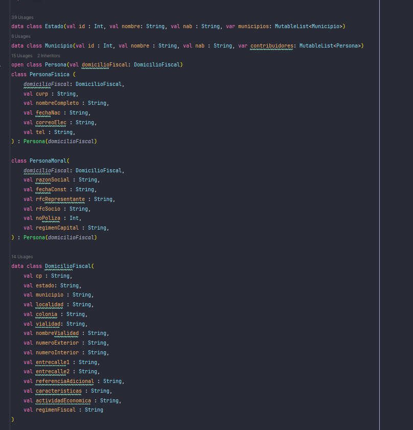
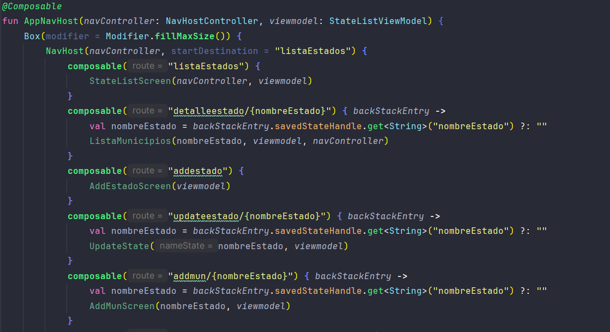
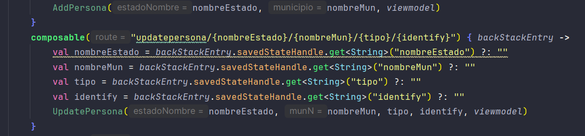
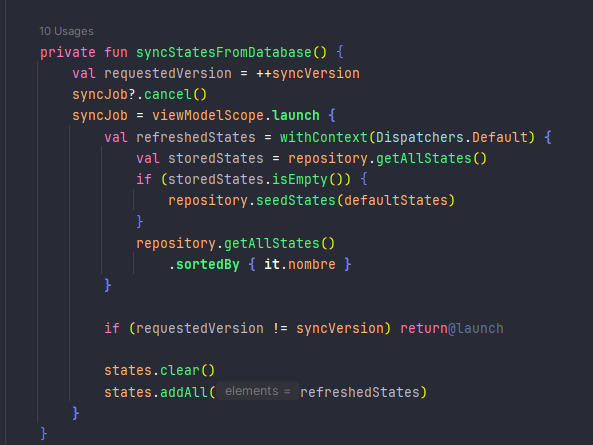

Miembros del equipo Christian Escutia Duran, Luis Angel Villanueva Tenorio.

<h1>Conclusiones del proyecto</h1>

Logramos desarrollar una app, con interfaz sencilla, funcional y optima.
Usando navegacion, diseño viewmodel y persistencia de datos gracias a sqlDelight.
Mejorando la optimización de la app, gracias al uso de corutinas. Enviando la actualización de la
base de datos a segundo plano.

</img>

Para lograr que esta aplicacion funcionara. Una estrategia que implementamos fue definir la funcionalidad sin depender de la base de datos.
Construyendo asi, la estructura de la informacion de la app. Antes incluso que cualquier otra cosa.

</img>

El segundo reto interesante fue implementar navegacion. Lo que hice fue crear un NavController que decidiera que composable llamar en cada ruta.

</img>

Algunas ventanas necesitaban informacion como el estado y municipio al que pertenecen, el nombre, rfc, etc. Asi que para poder mandar la informacion.
Lo que hice fue incluirla en la ruta como plantilla.

</img>

Por ultimo, para favorecer la optimizacion de la app. Cada que se actualizaba la base de datos lo hacia en un hilo secundario.
Esto lo logramos con la funcion viewModelScope.launch. La cual manda la funcion a otro hilo.

Cabe decir que states solo se actualiza con el contenido de la base de datos una vez en toda la ejecucion de la app.
Especificamente al ejecutar la app.

</img>
